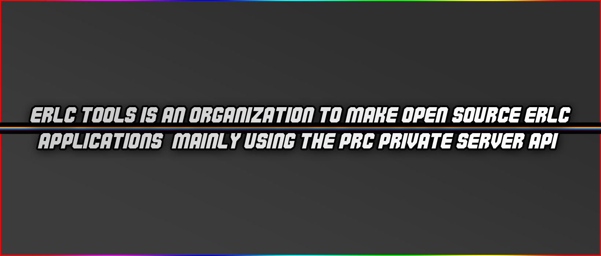

</img>

---

<strong>👍powered by <a href="github.com">github</a>, <a href="git-scm.com">git</a>, and <a href="https://code.visualstudio.com/">vsc</a></strong>

---

</img>

<h4><strong>directory</strong></h4>

- [erlc-py](https://github.com/erlc-tools/erlcpy)
- [playtime](https://github.com/erlc-tools/playtime)
- [reasoning](https://github.com/erlc-tools/reasoning)

<h4><strong>data</strong></h4>

- [reasoning](https://github.com/erlc-tools/reasoning) 
- [playtime](https://github.com/erlc-tools/playtime) 
